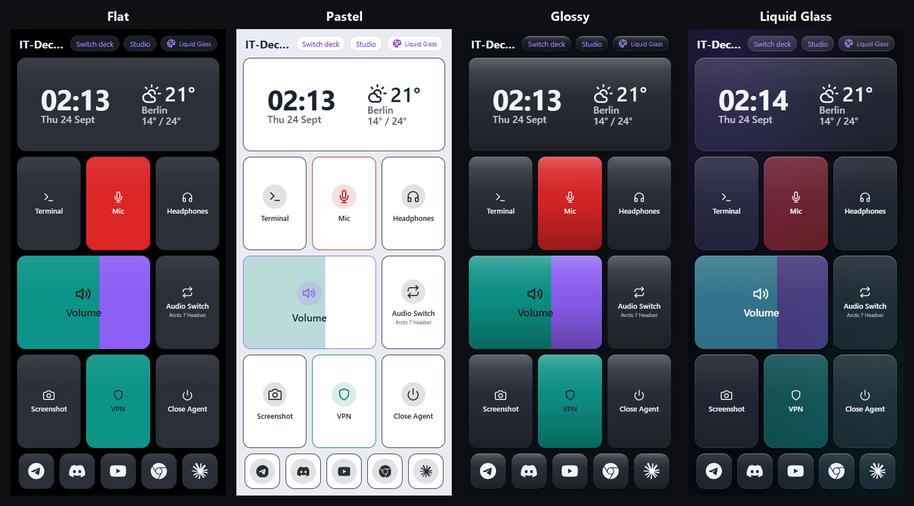

# IT-Deck


An old iPhone becomes a control deck for your Windows PC. One `.exe` on the
PC, a QR code, and the phone is a Stream Deck that also shows what the PC is
actually doing.

**[Русская версия](README.ru.md)**

| The deck, on your phone | Studio, on the PC |
| --- | --- |
|  |  |

The tiles report real state, not just clicks: above, the microphone is
**muted** (red), volume sits at **62 %**, Audio Switch names the **current
output device**, and **VPN is lit** because the client is running. Along the
bottom is the **quick-launch bar** — sites and programs one tap away (it moves
to the left side when the phone is sideways). **Studio** (right) is where the
deck is built — click a tile in the live preview to edit it, `+` to add one,
drag to move.

Four themes, each on a dark or light background:



## Quick start

Everything runs on the PC you want to control. No server, no Docker, no
Python on that machine.

1. **Download `ITDeck.exe`** from the
   [latest release](https://github.com/Itegin/it-deck/releases/latest) and
   run it. The first time, a short tour walks you through setup; after that
   this window stays open:

   

2. **Point your phone's camera at the QR code**, on the same Wi-Fi. That is
   the only required step — the token is in the link, and the phone keeps it.
   If the address doesn't open, the window lists this PC's other addresses
   under it.

3. **Optional:** every tile works out of the box except **VPN**, which has to
   be told which program to launch. See
   [Configuring the VPN tile](#configuring-the-vpn-tile).

**Quit** in that window stops IT-Deck; **Minimize** leaves it running with the
phone connected. Anything IT-Deck launched for you — your VPN client included
— keeps running either way.

On first launch it also puts an **IT-Deck** shortcut on your Desktop (use that
from then on), generates `%LOCALAPPDATA%\IT-Deck\config.env` with two tokens
(both `admin` by default) and a port (`49732`, or the next free one), and
starts the backend and the Windows agent as separate processes. There is no
console: the logs are in `%LOCALAPPDATA%\IT-Deck\logs\`. Config and tokens
survive restarts — deleting `config.env` or changing the port invalidates the
link your phone already has, so open the newly printed one once afterwards.

**You need** a Windows PC to control (the agent uses Windows COM audio APIs
and runs in the interactive user session) and a phone with a browser on the
same LAN.

<details>
<summary>Or build the exe yourself</summary>

```
git clone https://github.com/Itegin/it-deck.git
cd it-deck
standalone\build.ps1
```

Needs **Python 3.7–3.12** on the machine that *builds* it (`comtypes`, used
for audio control, has no 3.13/3.14 support). The result is
`standalone\dist\ITDeck.exe`, ~29 MB, which needs nothing installed to run.

</details>

## The tiles

Tapping a tile sends a command over a WebSocket to the Windows agent, which
runs it and reports back. Every command resolves within 5 seconds — ok, error
or timeout — and the tile shows which. Long-press opens a menu with **Force
Stop** for a stuck process.

A fresh install seeds eight, all wired to something real:

| Tile | What it does |
| --- | --- |
| **Terminal** | Launches an app — Windows Terminal by default |
| **Mic** | Mutes/unmutes the microphone; red while muted |
| **Volume** | Drag to set the system output volume |
| **Headphones** | Mutes/unmutes speaker output |
| **Audio Switch** | Swaps between two output devices, naming the current one |
| **Screenshot** | Captures the primary monitor to the **PC's** clipboard |
| **VPN** | Launches your VPN client, lit while it runs — **needs a path first** |
| **Close Agent** | Stops the agent; **Start the agent** in the IT-Deck window brings it back |

Studio adds more: **Clock & weather** (the phone's own time and date
plus the weather for a city you pick — Open-Meteo, no API key) and **Program
on/off**, which starts a program or closes it if it is already running, plus
the quick-launch tiles below.

**Quick launch.** **Open a website** opens any address in the PC's browser
(one-tap presets for Telegram Web, Discord, YouTube, ChatGPT and more), and
**Open an app** picks a program straight from the PC's Start Menu. They go to
the **quick-launch bar**: up to seven square buttons along the bottom of an
upright phone, or down the left side of a sideways one. Icons can be a
symbol, a logo, a few letters or the site's own icon.

When the PC end goes away — the agent closed, or IT-Deck itself — every tile
becomes a button that can't do anything, so the clock widget takes the whole
screen as a seven-segment clock and keeps showing the time until the PC comes
back. The deck restores itself; there is nothing to switch.

The look is two settings: the **theme** (Flat, Pastel, Glossy, Liquid Glass),
cycled from the pill in the deck's header, and the **background** (auto, light
or dark), set in Studio. Both sync to every connected phone.

## Studio

`/studio.html` on the PC — the **Open Studio** button in the window. A live
preview of the deck on the left, an editor on the right: you pick what a tile
does from cards instead of typing command names and JSON, audio devices come
from the list the agent reports, programs come from **Choose from installed
programs** (Start Menu and Microsoft Store apps), **Where** puts a button in
the grid or the quick-launch bar, and **Compact layout** closes the gaps.
English or Russian, following the browser. The phone never edits the catalog.
**Guide** in the top bar is a short illustrated how-to, and it opens by itself
the first time.

### Configuring the VPN tile

Until a path is set, a **Set the path to your VPN client** card sits at the
top of Studio. Paste the full path to the client's `.exe` and press **Save** —
the quickest way to get it is to select the file in Explorer and press
**Ctrl+Shift+C**, quotes and all; Studio strips them.

The tile then lights up whenever that program runs, including before you ever
press it. Pressing it **starts** the VPN — to stop one, long-press and use
**Force Stop**.

**If the tile reports that the program runs as administrator**, that is the
usual reason a VPN tile looks dead: Windows puts a UAC prompt on the PC and
you are holding a phone. Either clear **Run this program as an administrator**
in the exe's Properties → Compatibility, or run `ITDeck.exe` as administrator.

<details>
<summary>If you'd rather have one tile that toggles it on and off</summary>

In the VPN tile's editor press **Change type**, pick **Program on/off**, and
fill in the process name (e.g. `v2RayTun.exe`) and the path to the exe. One
press then starts it and the next stops it — with no confirmation step, which
is why it isn't the default.

</details>

## Updates

The window checks the releases page once at startup and shows a **Download**
button if a newer version exists. One request, nothing about you is sent, and
any failure is ignored silently. Turn it off with `UPDATE_CHECK=0` in
`config.env`. Only the exe can be out of date — the phone loads the deck from
whatever version is running.

## Removing it

Step 3 of the window has a quiet **Remove IT-Deck from this PC** button. It
deletes the exe, the Desktop shortcut, your settings, tokens and tile layout,
its Windows Firewall rules, and the temp directory the exe unpacks into —
which is everything IT-Deck ever writes. Deleting the exe on its own leaves
the other four behind.

It asks first, in a window listing what will go; Cancel holds the focus, so
Enter or Escape closes it without deleting anything. Windows asks for
permission once, only to remove the firewall rules — refusing that still
removes everything else. The home-screen icon on your phone stays; remove
that one on the phone.

## Troubleshooting

| Symptom | Fix |
| --- | --- |
| The QR code / link doesn't open on the phone | Try the other addresses the window lists under the link — a PC with a VPN, Hyper-V or WSL has several |
| No address works | Windows Firewall — a cancelled prompt leaves **Block** rules for `itdeck.exe`. Delete them in the inbound rules, or make the network Private |
| The phone asks for a token | Its stored one no longer matches. Open the freshly printed `?token=…` link once |
| IT-Deck says the port is already in use | Another copy is already running. Quit it from its window, or end `ITDeck.exe` in Task Manager |
| The VPN tile does nothing | It most likely has no path yet (see above). If it has one, check whether that program runs as administrator |
| A tile that needs the PC does nothing, or the deck turns into a clock | The agent is down. After a crash it restarts itself; after **Close Agent**, press **Start the agent** in the window. `logs\agent.log` says why, `launcher.log` records the restarts |
| A change doesn't show on the phone | Pull down to reload, or close and reopen the Home Screen icon |
| Nothing starts at all | `%LOCALAPPDATA%\IT-Deck\logs\backend.log` |

## Documentation

| Where | What |
| --- | --- |
| this file | What IT-Deck is, how to install and run it |
| [`CHANGELOG.md`](CHANGELOG.md) | What changed in each release |
| [`CONTRIBUTING.md`](CONTRIBUTING.md) | **For developers:** set up in three commands, the checks to run, the rules that are easy to break, how a release is made |
| [`docs/DEVELOPMENT.md`](docs/DEVELOPMENT.md) | How it works and how to extend it: architecture diagrams, the WebSocket protocol, debugging, step-by-step recipes |
| [`docs/ARCHITECTURE.md`](docs/ARCHITECTURE.md) | Why it is built this way — the decisions, including the ones kept for compatibility |
| [`docs/IT-Deck_Tech_Reference.md`](docs/IT-Deck_Tech_Reference.md) | The full reference — architecture, schema, API, protocol, tiles, themes, the agent, **standalone mode (§10)** and known tech debt |
| [`tests/`](tests) | Backend, WebSocket, database, agent and frontend tests — run on Linux and Windows for every pull request |
| [`docs/legacy-server.md`](docs/legacy-server.md) | The pre-v0.3.0 setup: backend in Docker on a separate server, plus the Ansible playbook |
| [`CLAUDE.md`](CLAUDE.md) | Working notes for Claude Code sessions: the rules and the things that are easy to break |

## Status

v0.5.3 — personal project, active development, API may change.
