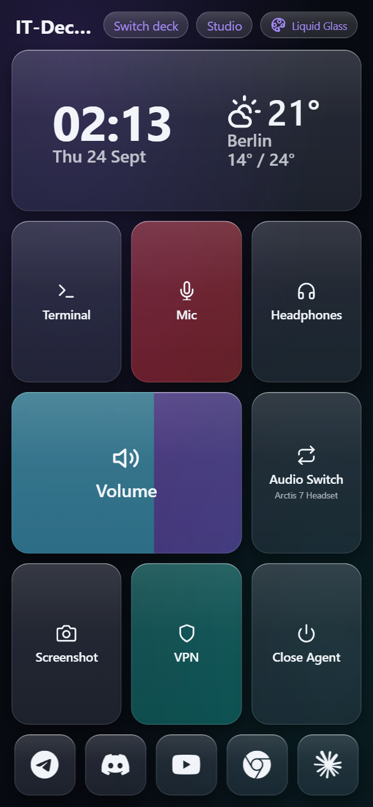
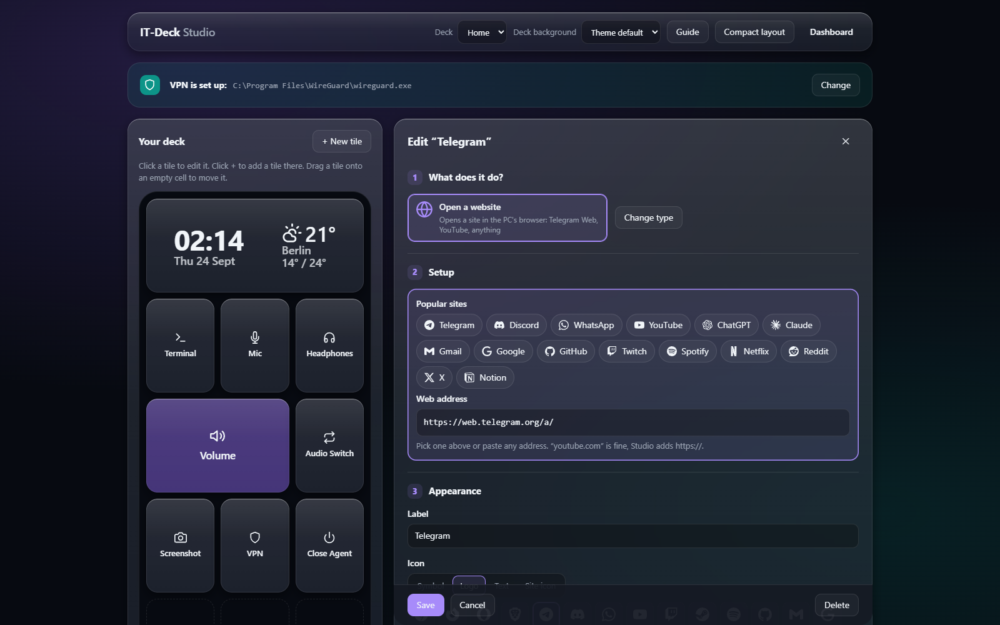
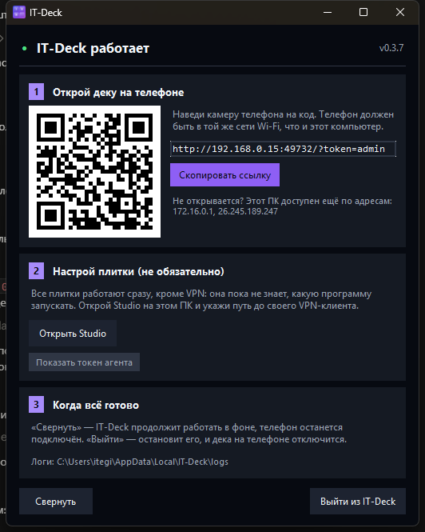

# IT-Deck


Self-hosted universal control surface that turns an old iPhone into a deck
for your PC.

| The deck, on your phone | Studio, on the PC |
| --- | --- |
|  |  |

And the window `ITDeck.exe` opens on the PC it controls — the whole setup, in
three steps, with a QR code so the phone needs no typing:



## Quick start (standalone)

Runs entirely on the PC you want to control — no separate server, no
Docker, no Ansible.

**Download `ITDeck.exe`** from the
[latest release](https://github.com/Itegin/it-deck/releases/latest) and run
it. The PC that runs it needs nothing installed, not even Python.

<details>
<summary>Or build it yourself</summary>

```
git clone https://github.com/Itegin/it-deck.git
cd it-deck
standalone\build.ps1
```

Needs **Python 3.7–3.12** on the machine that *builds* it (`comtypes`, used
for audio control, doesn't support 3.13/3.14 — see
`agents/windows/requirements.txt`). The result is
`standalone\dist\ITDeck.exe` (~26 MB).

</details>

Run `ITDeck.exe` once. On first launch it:

1. Adds an **IT-Deck** shortcut to your Desktop — every launch after this
   first one, use that instead of `standalone\dist\ITDeck.exe`.
2. Generates `AGENT_TOKEN` and `CLIENT_TOKEN`, both defaulting to `admin`
   — a self-hosted LAN gets little real security from a token anyway;
   hand-edit `%LOCALAPPDATA%\IT-Deck\config.env` if you want real ones —
   and picks a port: `49732` by default (IANA's dynamic range, so it won't
   fight the dev servers, Docker Desktop and friends that all want `8000`),
   walking upward if that one is taken. Want a specific port? Change
   `SERVER_PORT` in `config.env` and relaunch. All three are kept across
   restarts — deleting `config.env` invalidates the URL your phone already
   has, and changing the port changes that URL too, so open the newly
   printed link on the phone once afterwards.
3. Starts the backend and the Windows agent as two separate processes, so
   closing/relaunching one doesn't take down the other.
4. Opens the window in the screenshot above. There is no console — everything
   IT-Deck logs goes to `%LOCALAPPDATA%\IT-Deck\logs\`.

**Step 1 is the only step you have to do: point your phone's camera at the QR
code**, on the same Wi-Fi as the PC. The token is in the link; the phone
stores it and strips it from the URL. (The link and a copy button are right
there too, if you'd rather send it to yourself.)

If the address doesn't open, the window lists this PC's other addresses under
the link — a PC with a VPN, Hyper-V or WSL has several, and IT-Deck picks the
one that looks most like a real LAN rather than whichever one Windows happens
to route through.

**Step 2 is optional** and the window says so: every tile works out of the box
except VPN, which has to be told what to launch (see below).

To stop IT-Deck, press **Quit** in that window. **Minimize** leaves it running
with your phone still connected. Anything IT-Deck launched for you, your VPN
client included, keeps running after it quits.

### Updates

The window checks the [releases page](https://github.com/Itegin/it-deck/releases/latest)
once at startup and shows a **Download** button if a newer version exists.
It is one request, it never sends anything about you, and any failure —
offline, blocked, rate-limited — is ignored silently. Turn it off with
`UPDATE_CHECK=0` in `config.env`.

Only `ITDeck.exe` can be out of date. The phone isn't an installed app: it
loads the deck from whatever version of the exe is running, so it can never
lag behind on its own.

**Requirements**: a Windows PC to control (the agent depends on
`pycaw`/`comtypes` — Windows COM audio APIs — and `pywin32`, so it only runs
on Windows, by design, in the interactive user session), and an iPhone or
any modern phone with a browser on the same LAN.

## What it does

The Dashboard (phone) shows a grid of tiles; tapping one sends a command over
a WebSocket to the Windows agent, which executes it and reports back. Every
command resolves within 5 seconds — ok, error, or timeout — and the tile shows
which. Long-pressing a tile opens a context menu with a **Force Stop** option
for killing a stuck process.

A fresh install seeds 8 tiles, all wired to a real command:

- **Terminal** — launch an app (`launch_app`; opens Windows Terminal by default)
- **Mic** — mute/unmute the microphone; turns red while muted
- **Volume** — drag to set system output volume
- **Headphones** — mute/unmute speaker output
- **Audio Switch** — swap between two configured output devices, showing the
  current one under the label
- **Screenshot** — capture the PC's primary monitor to the **PC's clipboard**
- **VPN** — launch your VPN client, lit while it's running (**needs configuring — see below**)
- **Close Agent** — stop the agent. It stays stopped: quit IT-Deck from its
  window and relaunch to bring it back

(Three earlier placeholder tiles — Lights, Spotify, Sleep PC — had no
handler behind them and just returned `unknown command`; they're gone from
new installs, and a startup fixup removes them from existing databases too.)

That catalog is only the starting point — **Studio Mode** (`/studio.html`) is
a separate desktop-only admin page for editing it directly (add/edit/delete
tiles, pick audio devices from the live agent, compact the layout). The phone
Dashboard never mutates the catalog.

### Configuring the VPN tile

It's the one seeded tile that can't work out of the box — it has to be told
which program to launch. In Studio Mode, edit the VPN item's `params`. It's
JSON, so Windows paths need doubled backslashes:

```json
{"active_style": "normal",
 "path": "C:\\Program Files (x86)\\v2RayTun\\v2RayTun.exe"}
```

The tile then lights up whenever that program is running — including before
you ever press it. Until it's configured, pressing it tells you what to set
rather than doing nothing.

Pressing it **starts** your VPN; it doesn't stop it. To stop one, long-press
the tile and use **Force Stop**.

**If the tile reports that the program runs as administrator**, that is the
single most common reason a VPN tile looks dead: Windows answers the launch
with a UAC prompt *on the PC*, and you're holding a phone. Two ways out —
right-click the exe → Properties → Compatibility → clear **Run this program
as an administrator**, or run `ITDeck.exe` itself as administrator, after
which it can start elevated programs with no prompt. (Note this flag can be
set per user by the installer, so the same VPN can need it on one PC and not
another.)

<details>
<summary>If you'd rather have one tile that toggles it on and off</summary>

Change the item's `type` to `process_toggle` in Studio and give it both a
`path` and a `process_name`:

```json
{"active_style": "normal",
 "process_name": "v2RayTun.exe",
 "path": "C:\\Program Files (x86)\\v2RayTun\\v2RayTun.exe"}
```

Then one press starts it and the next stops it. There's no confirmation step,
so a mis-tap on a lit tile disconnects you — which is why it isn't the
default.

</details>

## Legacy: multi-device server deployment

Before v0.3.0, IT-Deck's backend ran as a Docker container on a separate
server, reached by a Windows agent and a phone over the LAN. This still
works and is documented below, but the standalone mode above is the
recommended path for a single controlled PC.

### Requirements

- A Debian/Linux server (or any Docker host) to run the backend container
- A Windows PC to control. The agent depends on `pycaw`/`comtypes` (Windows
  COM audio APIs) and `pywin32`, so it only runs on Windows, by design, and it
  must run in the interactive user session. **Python 3.7–3.12** — `comtypes`
  does not support 3.13/3.14.
- An iPhone or any modern phone with a browser — it's a PWA served over the
  LAN, not a native app

### Setup

1. Clone this repo onto the server that will run the backend:
   ```
   git clone https://github.com/Itegin/it-deck.git
   cd it-deck
   cp .env.example .env
   ```
   `AGENT_TOKEN` — the shared secret the Windows agent and Studio Mode both
   need — is the only value the backend itself actually reads at runtime.
   The other two entries in `.env.example` are carried so the agent, compose
   and the firewall agree: `SERVER_IP` appears nowhere in `backend/`, and
   changing `SERVER_PORT` here alone does **not** move the backend, because
   the port also lives in `docker-compose.yml`'s mapping and
   `backend/Dockerfile`'s `uvicorn --port`. Change all three together.
   (`backend/app/config.py` reads `SERVER_PORT`, but nothing imports it.)

2. Start the backend, building the image locally:
   ```
   docker compose up -d --build
   ```
   `./deploy.sh` does the same thing plus a git pull, a health check, and a
   check that the code inside the container matches the code on disk — run
   it instead once the server is already set up, for every later update.

3. Copy (or clone) `agents/windows/` onto the Windows PC being controlled:
   ```
   cd agents/windows
   pip install -r requirements.txt
   cp .env.example .env
   ```
   Fill in `SERVER_IP` (the backend server's LAN IP), `SERVER_PORT`,
   `AGENT_TOKEN` (same value as the backend's), and the audio/VPN values for
   your own hardware — see the comments in `.env.example`. The two
   `OUTPUT_DEVICE_*` values must be SoundVolumeView's full "Command-Line
   Friendly ID", not a bare device name.

4. Start the agent with `start_agent.bat`. On first run it creates an
   **IT-Deck Agent** shortcut on the desktop, which is how it's launched from
   then on; the window stays open only if the agent exited non-zero, and the
   text in it is the error. A singleton mutex stops two copies running at once.

   `install_task.ps1` registers a Scheduled Task to start the agent at logon
   (as the interactive user, never SYSTEM). Per `CLAUDE.md` that task is
   currently disabled on the maintainer's PCs in favour of the manual
   shortcut, so treat it as optional.

5. On the phone, open `http://<server-lan-ip>:8000` in the browser and add it
   to the home screen.

### Automated server setup

Steps 1–2 above can be done in one shot with the Ansible playbook in
`ansible/` against a fresh Debian 12 server:

```
ansible-galaxy collection install -r ansible/requirements.yml
cp ansible/inventory.yml.example ansible/inventory.yml
# edit ansible/inventory.yml with your server's IP, user, and SSH key
ansible-playbook -i ansible/inventory.yml ansible/site.yml
```

It provisions rather more than the manual steps: base packages, Docker via
get.docker.com (Debian's `docker.io` has no compose v2), a `ufw` firewall
(22/80/443/8000 open, default-deny inbound), **nginx as a TLS reverse proxy**
with a self-signed `itdeck.local` cert and WebSocket upgrade handling, the app
checkout and first `docker compose up`, a daily backup cron job, and a
loopback-only Prometheus + node_exporter monitoring stack (no firewall rule —
reach it with `ssh -L 9090:127.0.0.1:9090`). It also swaps Debian's apt
mirrors for a Yandex mirror.

It's safe to re-run: an existing `.env` is never overwritten, and the TLS cert
is not regenerated. The repo is cloned anonymously over **HTTPS**, so no git
SSH key is needed on the target — the key that is required is the
`ansible_ssh_private_key_file` in your `inventory.yml`, for Ansible's own SSH
connection to the server. See `ansible/site.yml` for what each step does and
why.

Note that after this playbook runs, the deck is reachable two ways —
`http://<ip>:8000` directly, and `https://<ip>` through nginx. Use the direct
HTTP one: the Dashboard opens its WebSocket as `ws://`, which a browser blocks
as mixed content on an HTTPS page.

## Troubleshooting

| Symptom | Fix |
| --- | --- |
| The QR code / link doesn't open on the phone | Try the other addresses the window lists under the link. IT-Deck ranks this PC's addresses and shows the most LAN-like one first, but a machine with several adapters can still surprise it |
| No address works | Windows Firewall — a cancelled prompt leaves **Block** rules for `itdeck.exe`. Delete them in the firewall's inbound rules, or make the network Private |
| The phone asks for a token | Its stored token no longer matches. Open the freshly printed `?token=…` link once |
| The VPN tile does nothing | Most likely it has no `path` yet — a fresh install seeds it unconfigured (see "Configuring the VPN tile"). If it's configured, check whether that program runs as administrator |
| A tile that needs the PC does nothing | The agent is down. The launcher restarts it automatically — `%LOCALAPPDATA%\IT-Deck\logs\agent.log` says why, and `launcher.log` beside it records the restarts |
| Nothing starts at all | `%LOCALAPPDATA%\IT-Deck\logs\backend.log` |

## Documentation

| Where | What |
| --- | --- |
| this file | What IT-Deck is, how to install and run it |
| [`CHANGELOG.md`](CHANGELOG.md) | What changed in each release |
| [`docs/IT-Deck_Tech_Reference.md`](docs/IT-Deck_Tech_Reference.md) | The full reference — architecture, DB schema, API surface, protocol, tile and theme internals, the Windows agent, **standalone mode (§10)**, the legacy deploy pipeline, and known tech debt |
| [`CLAUDE.md`](CLAUDE.md) | Working notes for Claude Code sessions: core rules and the constraints that are easy to break |

## Status

v0.4.0 — personal project, active development, API may change.
